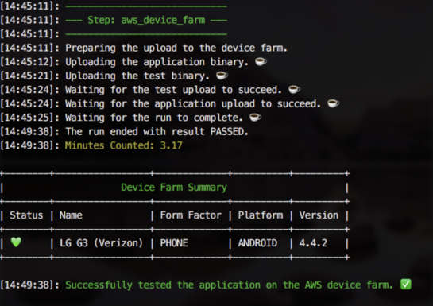
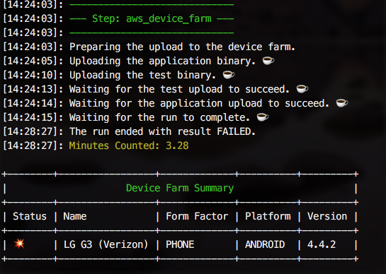

# AWS Device Farm Plugin for Fastlane

[](https://rubygems.org/gems/fastlane-plugin-sharethemeal)


## About
> This Plugin Allows XCUITests and android Instrumentation tests run on AWS device Farm


| iOS | Android | Fail |
|----------|-------------|-------------|
|  |  |  |


## Setup
### Add Plugin
```
fastlane add_plugin aws_device_farm
```

### Create Device Pools
Open your AWS dashboard and under `AWS-Device Farm` - configure your Device Pools.
Select the devices you want to run the tests on.


### Create a project on AWS
in this example we called this `fastlane`

## Example iOS

```ruby
lane :aws_device_run_ios do
  ENV['AWS_ACCESS_KEY_ID']     = 'xxxxx'
  ENV['AWS_SECRET_ACCESS_KEY'] = 'xxxxx'
  ENV['AWS_REGION']            = 'us-west-2'

  aws_device_farm(
    name:                'fastlane',
    binary_path:         'aws/packages/app.ipa',
    test_binary_path:    'aws/packages/runner.ipa',
    device_pool:         'iOS',
    wait_for_completion: true
  )
end
```


## Example Android

```ruby
lane :aws_device_run_android do
  ENV['AWS_ACCESS_KEY_ID']     = 'xxxxx'
  ENV['AWS_SECRET_ACCESS_KEY'] = 'xxxxx'
  ENV['AWS_REGION']            = 'us-west-2'

  aws_device_farm(
    name:                'fastlane',
    binary_path:         'app/build/outputs/apk/app-debug.apk',
    test_binary_path:    'app/build/outputs/apk/app-debug-androidTest-unaligned.apk',
    device_pool:         'Android',
    wait_for_completion: true
  )
end
```


## iOS Build IPA's
You could use something like this.
after this you have `aws/packages/app.ipa` and `aws/packages/runner.ipa`

```ruby
xcodebuild(
  clean: true,
  workspace: 'FiveXFive.xcworkspace',
  scheme: 'UITests',
  destination: 'generic/platform=iOS',
  configuration: 'Development',
  derivedDataPath: 'aws',
  xcargs: "GCC_PREPROCESSOR_DEFINITIONS='AWS_UI_TEST' ENABLE_BITCODE=NO CODE_SIGN_IDENTITY="" CODE_SIGNING_REQUIRED=NO build-for-testing"
)
FileUtils.rm_rf '../aws/packages'
Dir['../aws/Build/Intermediates/CodeCoverage/Products/Development-iphoneos/*.app'].each do |app|
  if app.include? 'Runner'
    FileUtils.mkdir_p '../aws/packages/runner/Payload'
    FileUtils.cp_r app, '../aws/packages/runner/Payload'
    `cd ../aws/packages/runner/; zip -r ../runner.ipa .; cd -`
  else
    FileUtils.mkdir_p '../aws/packages/app/Payload'
    FileUtils.cp_r app, '../aws/packages/app/Payload'
    `cd ../aws/packages/app/; zip -r ../app.ipa .; cd -`
  end
end
```


## Android Build APK's
you could use something like this.
after this you have the app-apk in `app/build/outputs/apk/app-debug.apk` and the testrunner in `app/build/outputs/apk/app-debug-androidTest-unaligned.apk`

```ruby
gradle(task: 'assembleDebug')
gradle(task: 'assembleAndroidTest')
```

## Credit
it is based on a custom action by @icapps (https://github.com/icapps/fastlane-configuration)
added the following:
  * iOS Support for XCUITests
  * support current `fastlane` version
  * improve output
  * make it available as a `fastlane` plugin
  

## Troubleshooting

If you have trouble using plugins, check out the [Plugins Troubleshooting](https://github.com/fastlane/fastlane/blob/master/fastlane/docs/PluginsTroubleshooting.md) doc in the main `fastlane` repo.


## About `fastlane`

`fastlane` is the easiest way to automate building and releasing your iOS and Android apps. To learn more, check out [fastlane.tools](https://fastlane.tools).
